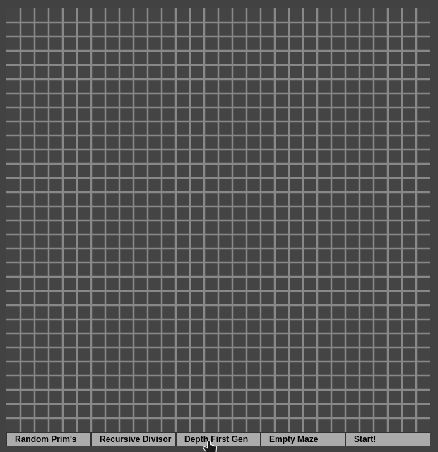

<h1>Maze Boomer</h1>

<h2>What it is</h2>

This sort of game involves building a maze with a choosen algorithm and then solve a path between two choosen cells with a choosen algorithm. When solving a path, the user can place and remove barriers in unexplored areas of the maze, affecting the solver path.

<h3>Note</h3>

This program is ready for placing as a component in an Angular frontend with [PIXI.js](https://www.npmjs.com/package/pixi.js/v/5.0.0-rc "PIXI.js npm page") ^5.2.1.

<h2>Features</h2>
<ul>
  <li>User can change loop rate of building and searching algorithms, affecting their speed</li>
  <li>User can place and remove barriers when searching, making the search interactive</li>
  <li>User can choose initial and goal state for searching algorithm</li>
  <li>User can see the trace of the searching algorithm</li>
</ul>

<h2>TODO</h2>
<ul>
  <li>Make a restart game button =p</li>
  <li>Make control bar UI better</li>
  <li>Fine tune the dragger that controls game speed</li>
  <li>Change rules of start button related to presence initial cell on building stage of game</li>
  <li>Add more searching and building algorithms</li>
</ul>

<h2>How to play</h2>

Left click in some algorithm in the bar at bottom of the canvas, then choose a start cell on the canvas with left click. Finally, click on the start button.
 

You can change the speed of the algorithm by dragging the dragger at the bottom of the canvas.

When the generator finishes, you may choose an algorithm for finding a path on the maze, then choose the start and goal cells with left and right click, respectively, and then click on the start button.

During the search, you can place and remove barriers in the maze with left click, but only in cells where the searcher didn't visit (visited cells are green) yet.

Again, you can drag the dragger to set the speed of the algorithm.

You must refresh the page to play again, as I didn't add the restart button yet, sorry.

